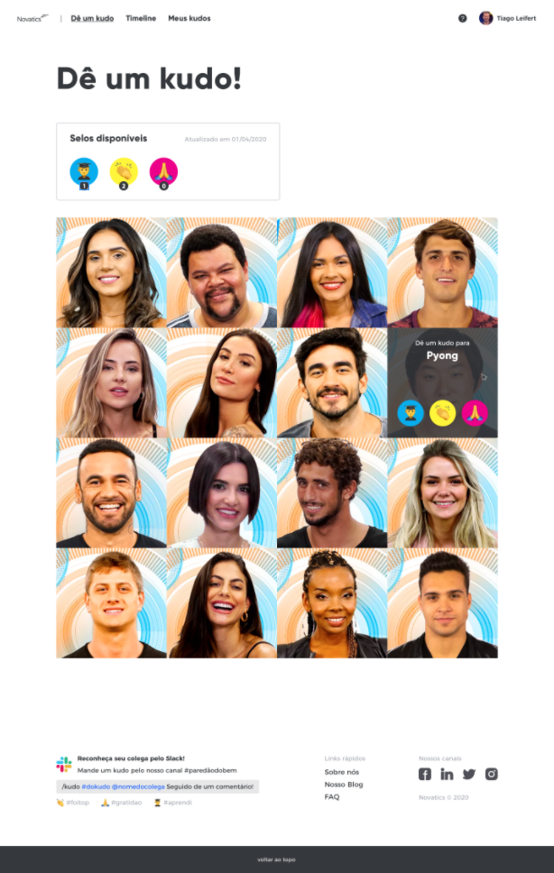

# Full-stack software engineer - Novatics Challenge
Challenge to work as software engineer at Novatics

## The Challenge

The objective of this challenge is to evaluate your domain in fullstack development: its organization, style and good practices with code, APIs creation, frameworks knowledge and technologies.

1. We want to see how you approach problem solving and use your skills to create an elegant engineering solution.
2. We want to see how you externalize the problem and communicate your work to other team members.

## The Problem

The Big Brother's are looking for a way to keep registered all the nice things that happen inside the house. They want to be more grateful for each other's acts. We discover 3 kinds of acts that worth to be registered: I learn, Was awesome, I'm grateful. Each participant will receive 6 kudo brooches, 2 for each act, and they could give these brooches for the friend that deserves.

Your challenge is create a virtual kudo board where the Big Brothers could interact and give your brooches.

### Front-end

The following layout should be developed

- You can use the libs and frameworks that make you more comfortable;
- All fields are required in the form;
- We'll be happy if you develop tests for it;

### Back-end

The layout has a form, a table with percentage information of participation and a pizza graph that represents this distribution.

- You need to create APIs that sends and receives these informations;
- We'll be happy if you develop tests for it;
- In case of inconsistency, return the error in a structured JSON with HTTP 400 code;

#### Plus

Feel free to make improviments like new funcionalities, visual optimizations, API security, etc. 😉

## Questions?

Send your questions directly to pessoas@novatics.com.br or opening a issue.
